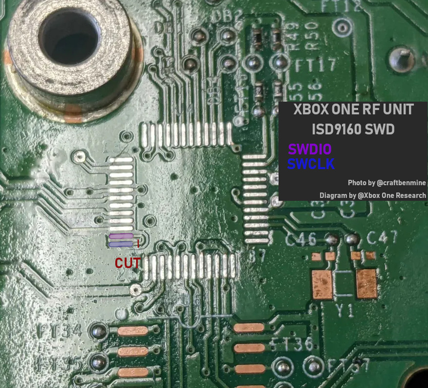
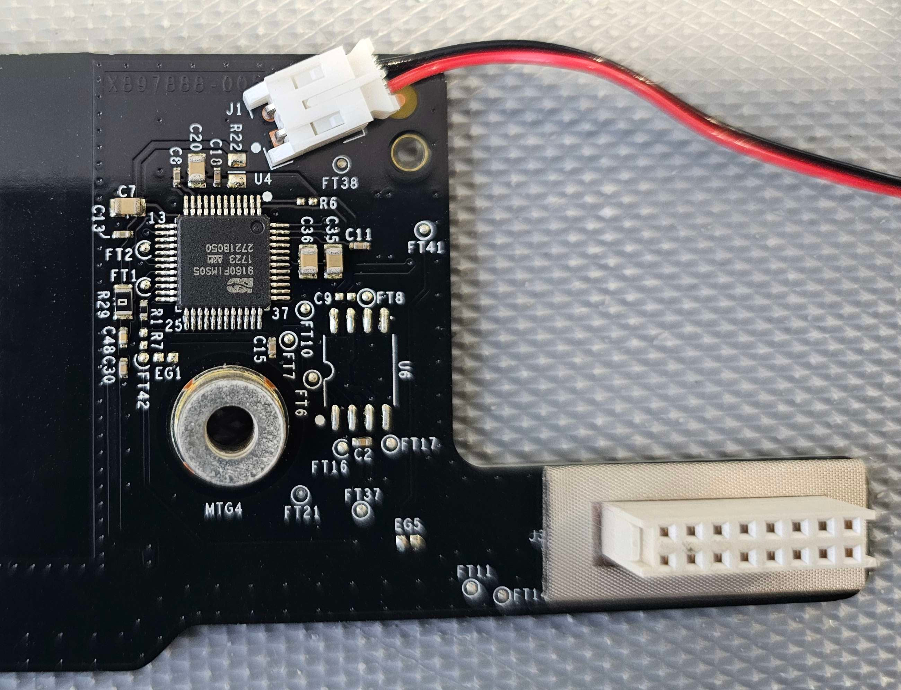

# RF Unit

## Info

Communication from the Nuvotun chip to the Southbridge is done via I2C.
The Nuvoton chip itself also supports ARM SWD!

By default, ISD9160 is available on OG Xbox One (PHAT).

On newer revisions than PHAT it's only populated on Limited edition consoles!

### Xbox One (PHAT)

Part Number: X867281-005
Codename: Lithium

Components:

- Infrared Receiver (U1)
- Soundchip - ISD9160F (U4)
- Connector to sound speaker (J1)
- Wifi Antenna connector (J2)
- FPC connector (J3)
- Motherboard connector (J8)
- Unpopulated (SW2)

####  General

The RF Unit, compared to Xbox 360, is very simple. It does not contain any RF hardware onboard.
It only contains an IR Receiver, the Nuvoton Soundcorder Chip (which also handles button presses from the front panel touch buttons) and an internal antenna.
Actual RF communication is happening via a [Wifi module](wifi.md).


#### Connector (J8)

Pinout

| Pin| Function        |
|----|-----------------|
|  1 | LED Nexus       |
|  2 | LED Halo        |
|  3 | LED Zone        |
|  4 | 5V (VCC)        |
|  5 | I2C CLK         |
|  6 | I2C DATA        |
|  7 | IR Data         |
|  8 | PWR Switch (N)  |
|  9 | GND             |
| 10 | EJECT Switch (N)|
| 11 | INT_N           |
| 12 | 3,3V STDBY      |
| 13 | BIND Switch (N) |
| 14 | GND             |
| 15 | -               |
| 16 | -               |
| 17 | -               |
| 18 | GND             |
| 19 | GND             |

#### FPC Connector (J3)

Pinout

| Pin | Function | ISD9160F Pin |
| ----| ---------| -------------|
| 1   |  Power   |            9 |
| 2   |  Power   |            8 |
| 3   |  -       |             -|
| 4   |  -       |             -|
| 5   |  -       |             -|
| 6   |  Eject   |            7 |
| 7   |  Eject   |            6 |

Bridge the respective pins briefly to trigger action.

FPC Cable / capacitive front panel buttons are directly wired to the ISD-Chip.

### Xbox One S

Codename: Sodium

#### Pinout

Connector

| Pin| Function        |
|----|-----------------|
|  1 | LED Nexus       |
|  2 | -               |
|  3 | IR Blaster      |
|  4 | PWR Switch (N)  |
|  5 | EJECT Switch (N)|
|  6 | INT_N           |
|  7 | 3,3V STDBY      |
|  8 | 5V              |
|  9 | ACC_RESET       |
| 10 | IR (RX)         |
| 11 | GND             |
| 12 | USB2 (-)        |
| 13 | USB2 (+)        |
| 14 | GND             |
| 15 | I2C CLK         |
| 16 | I2C DATA        |

### Xbox One X

Codename: Cactus

**NOTE**: Front panel on Xbox One X does not use I2C anymore.

#### Pinout

| Pin| Function        |
|----|-----------------|
|  1 | IR (RX)         |
|  2 | EJECT Switch (N)|
|  3 | -               |
|  4 | IR Blaster      |
|  5 | ACC_RESET       |
|  6 | GND             |
|  7 | USB2 (-)        |
|  8 | USB2 (+)        |
|  9 | 3,3V STDBY      |
| 10 | GND             |
| 11 | -               |
| 12 | -               |
| 13 | -               |
| 14 | PWR Switch (N)  |
| 15 | LED Nexus       |
| 16 | 5V              |

### Nuvoton Soundcorder chip

Responsible for playing the power-on/off and eject sounds.

Model: ISD9160F

Datasheet: [ISD9160FI](../_files/rf-unit/1811151450_Nuvoton-Tech-ISD9160FI_C79806.pdf)

Pinout (from the official datasheet linked above)


This IC has multiple possible pin-configurations, the following are verified signals.

| Pin | Function                   |
| --- | -------------------------- |
|   6 | Eject button (FPC - Pin 7) |
|   7 | Eject button (FPC - Pin 6) |
|   8 | Power button (FPC - Pin 2) |
|   9 | Power button (FPC - Pin 1) |
|  47 | I2C SCL (CLK)              |
|  46 | I2C SDA (DAT)              |

#### Firmwares

So far, three different firmwares have been seen

(SHA256 hash is over 0x24400 bytes)

```
# RETAIL

SHA256: abc699513959372faee038c78a1d7509c2020f65cb78ad07ab9c90b21b406a87

ISD-VPE Ver 920.000c 08/05/2013 PV_Prod_Units_Rev5 VERSION:0x10000007
ISD9160FIMS03 FW Jun 14 2013 at 10:41:12 (C) Nuvoton 2013
Nuvoton ISD9160MS Boot FW Jun 14 2013 10:40:21 
Nuvoton ISD9160MS Boot FW Jun 14 2013 10:40:21 

# EV3B

SHA256: 7fd817a51086ba9089ce04168f73fdf753aedcbb2f63a19b3ff7be06e668a8e1

ISD-VPE Ver 920.0008 04/06/2013 EV3B_Prod_Units_Rev1 VERSION:0x10000003 Release 1.0
ISD9160FIMS03 FW Jun 14 2013 at 10:41:12 (C) Nuvoton 2013
Nuvoton ISD9160MS Boot FW Jun 14 2013 10:40:21 
Nuvoton ISD9160MS Boot FW Feb  1 2013 15:17:36

# TACOBELL

SHA256: c39871fcfef69c632955658f8e876d35a35dafb9c88c7fc082dca23d2102289f

ISD-VPE Ver 930.0000 03/19/2018 PV_MASA_V4 VERSION:0x10000007
ISD9160FIMS05 I2C Jan 12 2015 at 14:09:09 (C) Nuvoton 2015
Nuvoton ISD9160MS Boot FW Jun 14 2013 10:40:21 
Nuvoton ISD9160MS Boot FW Jun 14 2013 10:40:21

# MINECRAFT One S

ISD-VPE Ver 930.0000 02/14/2017 EV_Mohawk_V2 VERSION:0x10000007
ISD9160FIMS05 I2C Jan 12 2015 at 14:09:09 (C) Nuvoton 2015
Nuvoton ISD9160MS Boot FW Jun 14 2013 10:40:21
Nuvoton ISD9160MS Boot FW Jun 14 2013 10:40:21

# COD AW

ISD-VPE Ver 920.000c 06/04/2014 Anvil_New_6_4 VERSION:0x10000007
ISD9160FIMS03 FW Jun 14 2013 at 10:41:12 (C) Nuvoton 2013
Nuvoton ISD9160MS Boot FW Jun 14 2013 10:40:21
Nuvoton ISD9160MS Boot FW Jun 14 2013 10:40:21

# HALO 5

ISD-VPE Ver 920.000c 04/15/2015 PV_Bigss_V2_Release VERSION:0x10000007
ISD9160FIMS03 FW Jun 14 2013 at 10:41:12 (C) Nuvoton 2013
Nuvoton ISD9160MS Boot FW Jun 14 2013 10:40:21
Nuvoton ISD9160MS Boot FW Jun 14 2013 10:40:21

# Forza 6

ISD-VPE Ver 920.000c 04/29/2015 PV_Raptor_V1 VERSION:0x10000007
ISD9160FIMS03 FW Jun 14 2013 at 10:41:12 (C) Nuvoton 2013
Nuvoton ISD9160MS Boot FW Jun 14 2013 10:40:21
Nuvoton ISD9160MS Boot FW Jun 14 2013 10:40:21
```

#### I2C

Communicating via I2C requires a Raspberry Pi Pico and soldering 3 wires.

See [Tools - DuRFUnitI2C](#tools)


I2C address: `0x5A (90)`


Status values

Reading 2 bytes from the I2C Slave yields current device status.
Only the first byte (LSB) seems to be of interest.


| Status                 | Mask |
| ---------------------- | ---- |
| Error                  | 0x04 |
| LDROM                  | 0x0C |
| Busy                   | 0x10 |
| Ready                  | 0x80 |
| LDROM Boot in progress | 0x88 |


Commands

NOTE: Infos based on FW

```
ISD-VPE Ver 920.000c 08/05/2013 PV_Prod_Units_Rev5 VERSION:0x10000007
ISD9160FIMS03 FW Jun 14 2013 at 10:41:12 (C) Nuvoton 2013
```

| Byte | Name                | Args                         | Returns data*| Note                               |
| ---- | ------------------- | ---------------------------- | ------------ | ---------------------------------- |
| 0x02 | Stop Sound          | /                            | No           |                                    |
| 0x1B | Boot APROM          | /                            | No           | To leave LDROM                     |
| 0x48 | Register Write      | Register, Data               | No           |                                    |
| 0x4A | Reset               | /                            | No           |                                    |
| 0x4B | Boot LDROM          | challenge-response: u32      | No           | Err: "Bad Boot Entry" if CR* wrong |
| 0xC0 | Interrupt Read      | /                            | Yes          |                                    |
| 0xC1 | Register Read       | /                            | 4 bytes      |                                    |
| 0xC2 | Get FW Version      | /                            | 128 bytes    | Returns null-terminated string     |
| 0xC3 | Flash Read          | address: u32                 | 8 bytes      | Discard first 2 (status) bytes     |
| 0xC4 | Get VPE Version     | /                            | 128 bytes    | Returns null-terminated string     |
| 0xC5 | Get Error           | /                            | 128 bytes    | Returns null-terminated string     |
| 0xC9 | Get Timervalue      | /                            | 6 bytes      | Returns u32, used for LDROM CR*    |
| 0x81 | Start Sound         | Sound index: byte            | No           |                                    |
| 0x8B | ?Boot repair?       | ?                            | No           |                                    |
| 0x95 | Flash Erase         | start: u32, count: u32       | No           | Only effective while in LDROM      |
| 0x9A | Flash Write         | data: n-bytes (count: 0x80)  | No           | Only effective while in LDROM      |
| 0x9B | Flash Set Write-Addr| offset: u32                  | No           | Only effective while in LDROM      |

* CR: Challenge Response
* Returns data: including 2 status bytes

Registers

Only the memory locations have been determined so far.

| Num  | Offset (SRAM) | Name /Identifier | Note                                                             |
| ---- | ------------- | ---------------- | ---------------------------------------------------------------- |
| 0x00 | 0x20000f24    |                  |                                                                  |
| 0x01 | 0x20000f25    |                  |                                                                  |
| 0x0c | 0x20000f16    |                  |                                                                  |
| 0x0d | 0x20000f20    |                  | Does modulo 16000 % $value$ and stores remainder in the register |
| 0x0e | 0x20000f22    |                  | If $value$ is 0, store 1                                         |
| 0x0f | 0x20000f23    |                  |                                                                  |
| 0x11 | 0x20000f21    |                  |                                                                  |
| 0x16 | 0x20000f26    |                  |                                                                  |
| 0x17 | 0x20000f27    |                  |                                                                  |
| 0x18 | 0x20000f2e    |                  |                                                                  |
| 0x19 | 0x20000f2f    |                  |                                                                  |
| 0x1a | 0x20000f19    |                  |                                                                  |
| 0x1c | 0x20000f30    |                  |                                                                  |
| 0x1f |  ?            |                  | PDMA related                                                     |
| 0x20 |  ?            |                  |                                                                  |
| 0x21 | 0x20000f32    |                  |                                                                  |
| 0x22 |  ?            |                  |                                                                  |
| 0x23 | 0x20000f2c    |                  |                                                                  |
| 0x28 | 0x20000f40    |                  |                                                                  |
| 0x29 | 0x20000f41    |                  |                                                                  |
| 0x2a |  ?            |                  |                                                                  |
| 0x2b | 0x20000f42    |                  |                                                                  |

Available sounds

| Index| Name         |
| ---- | ------------ |
| 0x00 | PowerOn      |
| 0x01 | Ding         |
| 0x02 | PowerOff     |
| 0x03 | DiscDrive1   |
| 0x04 | DiscDrive2   |
| 0x05 | DiscDrive3   |
| 0x06 | Plopp        |
| 0x07 | No Disc      |
| 0x08 | Plopp Louder |

Init sequence:

```
WRITE [CMD_REGISTER_WRITE, 0x0C]
WRITE [CMD_REGISTER_WRITE, 0x04, 0xFF, 0xFF]
```

To get a sound playing, this is the full flow done by the console

```
- Init
- Stop
- Play sound
```

#### Reading and Writing the chip via SWD (Recovery)

Alternatively to I2C, the ARM SWD protocol can be used to read/write the chip.

Requirements:

Software

- Linux
- OpenOCD build, patched for ISD9160 support (see https://github.com/xboxoneresearch/DuRFUnitI2C/releases/tag/openocd_build)
- Debugprobe firmware for PiPico (debugprobe_on_pico/2.uf2) - https://github.com/raspberrypi/debugprobe/releases

Hardware

- Raspberry Pi Pico/2
- Soldering equipment
- Sharp tweezers

By default, the required pins on the IC are bridged on the RF Unit PCB. To enable usage of SWD, a trace needs to be cut, using pointy tweezers for example. 

Make sure to use a multimeter to confirm the trace was cut properly.



Steps:

- Do the trace-cut mentioned above
- Flash debugprobe firmware on Pi Pico/2
- Connect Pi Pico to ISD9160 SWD pins (see https://mcuoneclipse.com/2022/09/17/picoprobe-using-the-raspberry-pi-pico-as-debug-probe/), 3V3 and GND
- Now extract and start OpenOCD

```
tar xvf openocd_isd9160.tar.gz
cd openocd_isd9160/
./bin/openocd -f ./share/openocd/scripts/interface/cmsis-dap.cfg -f ./share/openocd/scripts/target/numicro.cfg
```

- In another terminal window connect via telnet

```
telnet localhost 4444
```

- First, dump the original `APROM` firmware

```
flash read_bank 0 aprom_original.bin
```

- Now, erase the bank and write new `APROM` firmware

```
flash erase_sector 0 0 last
flash write_bank 0 aprom_new.bin
```

- Profit


## Pictures
### Xbox One (PHAT)


### Xbox One S




### Xbox One X (SCORPIO)

[](../_files/rf-unit/rf_unit_onex_front.jpg)
[](../_files/rf-unit/rf_unit_onex_back.jpg)
[](../_files/rf-unit/rf_unit_onex_front_detailed.jpg)


## Tools

- [DuRFUnitI2C](https://github.com/xboxoneresearch/DuRFUnitI2C) - (Python) Communicate with the (PHAT) RF Unit and read/write its flash

## Credits
- [Xbox One PHAT and One S Pictures from ifixit.com](https://www.ifixit.com/Search?c-doctype_namespace=product&doctype=product&query=xbox%20one)
- Xbox One X Pictures taken by jacksomness
- Xbox One S RF Unit with ISD9160 populated - by akim14
- @craftbenmine - RF Unit SWD hardware work, photos, testing
